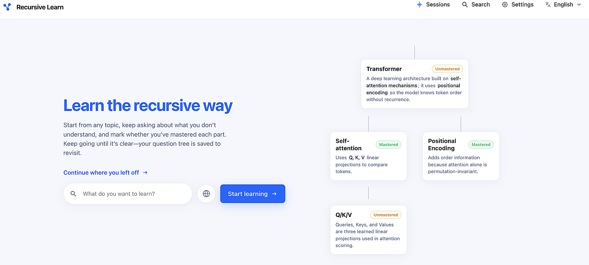

<p align="center">
  <a href="README.md"></a>
  <a href="README.zh-CN.md"></a>
</p>

# Recursive Learn

<p align="center">
  
</p>

When you learn with AI, you often skim a long answer, hit an unfamiliar concept, dig in, find another fuzzy term—and keep branching **down along what you do not yet understand** until each step is clear. **Recursive Learn** supports that workflow: questions become a **traceable tree**, each node can be marked **learned vs. not**, so you can deep-dive along one branch first, then jump back anywhere on the tree.

---

## Principles

- **Follow-up chains beat one-shot walls of text.** The unit of learning is *question → answer → follow-up*, not a single dense summary.
- **Mastery is explicit.** Nodes can be tagged so you always see **what still needs work**.
- **Structure survives revisits.** Under one topic, threads form an **exploration tree** (rooted learning sessions)—you are less likely to get lost than in endless flat chat transcripts.

---

## What you can do

| Capability | Description |
|------------|-------------|
| Start from a topic | On the home page, enter a topic to create a **root node**; the model answers with optional web search |
| Drill down | Ask a **follow-up** where you are stuck; create a **child node** so the thread stays structured, or use **Just ask** for a quick sidebar without branching immediately |
| Sessions & full tree | **Sessions** lists each root topic; open one session to browse the **full tree**, jump between nodes |
| Search | **Search** finds nodes across sessions by keyword and opens them |
| Local-first data | Learning data stays in **IndexedDB** on your machine; **Settings** lets you export / import JSON backups |
| Model & search | Configure provider and API keys under **Settings**; optional web search (e.g. Tavily, Brave, Exa—keys stored in the browser). Requests **can** route through **your deployed** app server before reaching vendors (environment variables supported on the server) |

---

## Supported LLM providers

- **OpenAI** (gpt-4o-mini, gpt-4o, etc.)
- **Google Gemini** (gemini-2.0-flash, etc.)
- **Anthropic Claude** (claude-sonnet, claude-opus, etc.)
- **DeepSeek** (deepseek-chat, deepseek-reasoner, etc.)
- **Moonshot Kimi** (moonshot-v1-8k, etc.)
- **Zhipu GLM** (glm-4-flash, glm-4, etc.)
- **Alibaba Qwen** (qwen-turbo, qwen-plus, etc.)
- **MiniMax** (MiniMax-M2.7, etc.) — uses Anthropic-compatible endpoint

---

## Getting started

1. **Install and run** (Node.js required):

   ```bash
   npm install
   npm run dev
   ```

   Open the app in your browser (usually `http://localhost:3000`).

2. **Configure keys.** Open **Settings**, pick an LLM provider and enter an API Key (or rely on server-side env). Add search keys only if you need live web retrieval. Save.
   - For **MiniMax**, use the API key from platform.minimaxi.com; the app communicates via Anthropic-compatible Messages API.
   - For **server-side setup**, see `.env.example` for all supported provider environment variables.

3. **Begin a thread.** Enter a topic and start learning; read the answer and ask the **next concrete question** beneath it. Branch with **create child**, or use **Just ask** for a lightweight Q&A without a new branch yet.

4. **Mark mastery.** Mark nodes as mastered or still open so next steps stay obvious.

5. **Jump between themes.** Use **Sessions** to list roots, open a tree view, create new roots, or delete a whole tree (confirm before destructive actions).

6. **Back up data.** Before switching browsers or clearing site data, use **Settings → Data management** to **Export JSON**, then **Import** elsewhere.

7. **UI language.** Toggle **Chinese / English** in the header; this does **not** force answer language—you control tone and wording in prompts.

---

## Tech stack

- **Next.js** (App Router), **React**, **TypeScript**, **Tailwind CSS**
- Persistence: **IndexedDB**; logic split across `src/domain` and components
- Testing: **Vitest**, **Playwright** (`npm run test`, `npm run test:e2e`)

---

## Production & Cloudflare

Standard Next.js production run:

```bash
npm run build
npm start
```

`npm start` serves on port **3000** (see `package.json`).

For **Cloudflare** (preview / deploy):

```bash
npm run preview   # OpenNext preview
npm run deploy    # Deploy with OpenNext for Cloudflare
```

---

## Privacy & safety

- API keys and most learning context stay **in your browser**; when you prompt, keys may reach **your** deployment’s server before third-party APIs. Avoid saving keys on untrusted devices—clear them in **Settings** when done.
- If the server exposes shared keys via environment variables, behavior follows your deployment config.

---

Improvements to copy or onboarding are welcome via PRs—keep this README aligned with how “recursive learning” shows up in the product.
